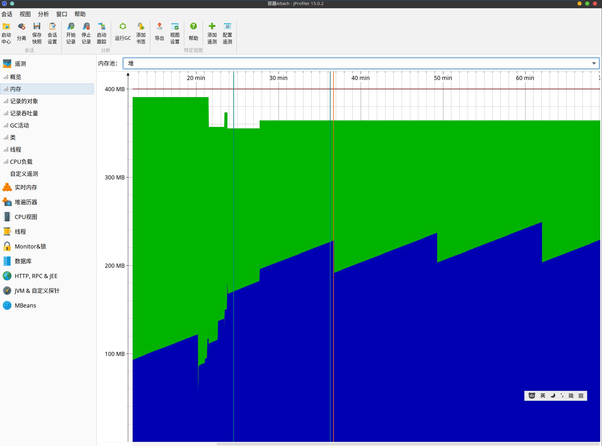

# Jprofile
 Jprofile可以查看jvm进程的相关信息如cpu负载、内存负载、http请求链路

# 安装
 姓名、和公司随便填、激活码选择下方对应版本
```
// v13
S-NEO_PENG#890808-g4tibemn0jen#37bb9

// v14
S-J14-NEO_PENG#890808-1jqjtz91lywcp9#23624

// v15
S-J15-NEO_PENG#890808-1a6eo5gvl1w9v#b6bab
```

# 使用jprofile定位内存泄露

- 内存泄露是指对象没有用处了，但不能被垃圾回收器回收，导致内存一直被占用。

## 编写测试代码
```java
public class LeakObject {
    private String name;
    public LeakObject() {
        this.name = RandomUtil.randomString(1024);
    }
}
```

```java

//静态对象不能被gc自动回收慢慢的就会占满内存
public static List<LeakObject> staticList = new ArrayList<>();

//模拟接口不断的生成对象
@GetMapping("/add") 
    public String add(@RequestParam int count){
        for (int i = 0; i < count; i++) {
            staticList.add(new LeakObject());
        }
        return "success add "+count+" objects";
    }

//模拟GC
    @GetMapping("/gc")
    public String gc(){
        System.gc();
        return "gc success";
    }

//清除泄露的对象
    @GetMapping("/clear")
    public String clear(){
        staticList.clear();
        System.gc();
        return "clear success";
    }
```

## 启动项目
- 添加内存限制命令 -Xms400m -Xmx400m 分配400M内存给程序更快的到达 out of memory状态
## jprofile链接当前的程序进程
### attach模式连接
  - 本地的可以直接链接
  - 远程的可以通过ssh连接 x86架构，arm架构。但国产的架构不支持
  

- 选择全采样
  

### 添加jvm参数链接
- java程序启动时指定jprofile agent的so文件位置启动
- 按照新会话指导链接
```shell
-agentpath:/opt/jprofiler15/bin/linux-x64/libjprofilerti.so=port=8849,nowait
```


## 分析内存泄露方法1
- 选择左上角分析-->标记堆内存
- 选择左侧堆遍历器
- 点击最大对象-->展开信息-->可以看到movieController的 staticList对象占用了128MB内存找到内存泄露的位置
     

## 分析内存泄露方法2
- 查看初始内存消耗
`可以看到分配了400M内存，内存中占用最大的对象说char数组也就是字符串`
  
  

- 调用 add接口  模拟内存泄露 
  - 上面定义了内存泄露的对象是一个长度为1024的字符串
  - 传递参数10000即产生10000个对象
  - 查看内存变化
  
  可以看到内存在不断增加，内存下降是发生了GC
  
  点击所有对象按对象大小排序，聚合级别选择类。
  - 右键选择在新的堆转储存展示
    
  - 选择引用->传入引用-->选择觉得可疑的对象-->显示GC根的内容 可以看到找到了对应的controller
    

## 使用jmap导出内存占用分析
```shell
jps
#输出如下
# 45506 Launcher
# 77415 Jps
# 10297 FrontendApplication
# 8364 Main
# 9852 SpiderApplication

# 9852就是进程id

#导出 9852进程的内存快照名称为heap.hprof
jmap -dump:live,format=b,file=heap.hprof 9852
```
- 使用jprofile打开
- 重复方法1

