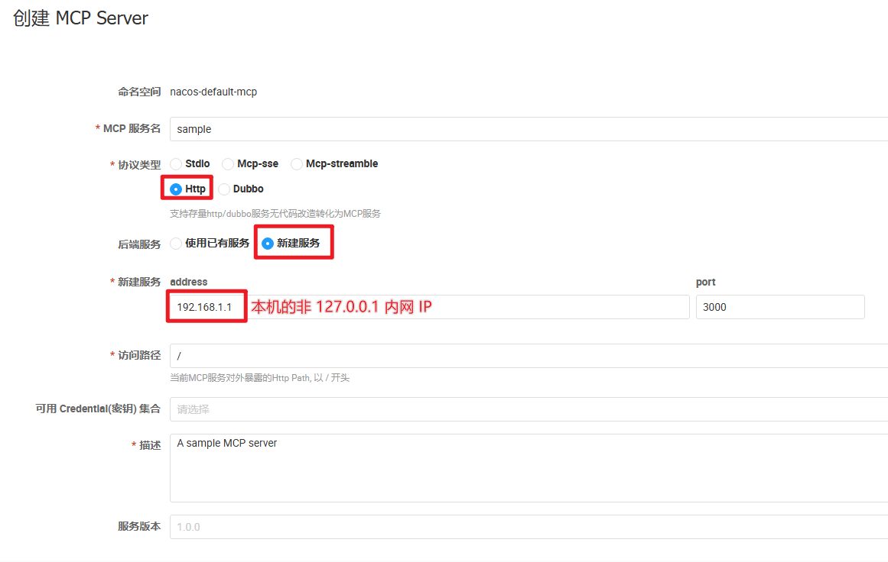
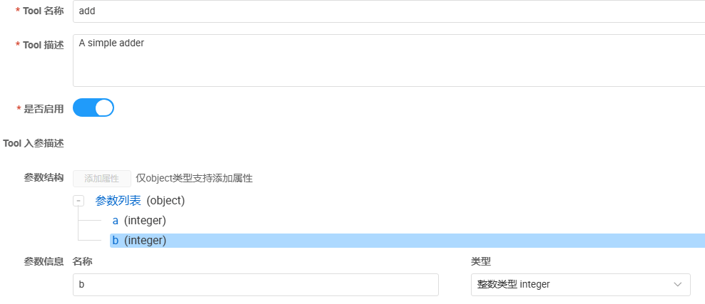
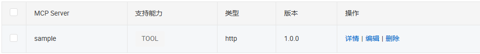
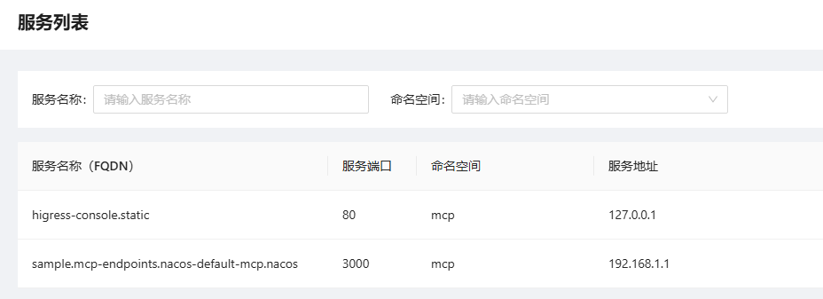
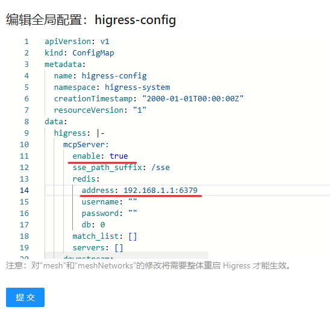
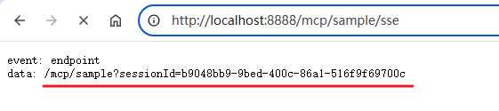
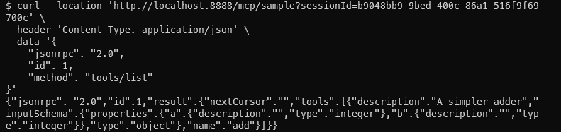
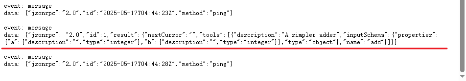
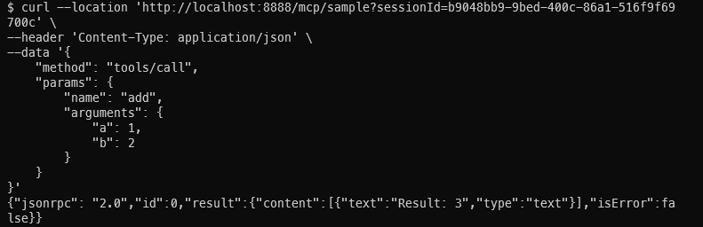
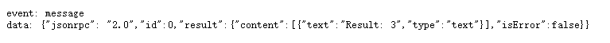

# 如何让 Higress 对接 Nacos 3 MCP Server 管理功能（HTTP 服务版）

## 概述

本文将介绍在 Nacos 3 上配置 MCP Server，将一个 HTTP Web Service 通过 Higress 暴露给 MCP Client 访问的完整过程。整个流程将基于一个测试用的简单后端服务实现进行。所有的配置内容也均以此服务所提供的功能为模版编写。建议大家先严格按照本文的步骤配置完成后再尝试自行调整配置对接其他服务。

## 环境准备

### 1. 部署 Higress

在本地使用 all-in-one 镜像方式启动 Higress：

```bash
# 创建一个工作目录
mkdir higress; cd higress
# 强制拉取最新的 all-in-one 镜像
docker pull higress-registry.cn-hangzhou.cr.aliyuncs.com/higress/all-in-one:latest
# 启动 higress，配置文件会写到工作目录下
docker run -d --rm --name higress-ai -v ${PWD}:/data \
        -p 8001:8001 -p 8888:8080 -p 8443:8443  \
        higress-registry.cn-hangzhou.cr.aliyuncs.com/higress/all-in-one:latest
```

安装完成后，在浏览器中访问 Higress Console，确认底部显示的版本号不低于 2.1.3。

### 2. 部署 Nacos

参考 Nacos 官网（[https://nacos.io)](https://nacos.io/)）部署 Nacos，版本不低于 4.0.0。推荐下载压缩包在本地用 standalone 单机模式启动的部署方式。此处不展开介绍。

### 3. 部署 Redis

在本地启动一个 Redis 实例。推荐使用 Docker 方式：

```bash
docker run --rm --name redis -p 6379:6379 higress-registry.cn-hangzhou.cr.aliyuncs.com/higress/redis-stack-server:7.4.0-v3
```

### 4. 启动后端服务

1. 测试服务使用 NodeJS 编写。所以请大家先访问 NodeJS 官网（[https://nodejs.org](https://nodejs.org/en)）下载并安装 NodeJS 运行环境
2. 下载[测试服务压缩包](../files/McpSampleServer.zip)
3. 解压至任意目录
4. 执行以下命令启动测试服务
    ```bash
    npm install
    npm start
    ```
5. 启动完成后，在浏览器访问 [http://localhost:3000/](http://localhost:3000)。若能够显示“Hello world!”，则代表服务启动成功。

## 配置流程

### Nacos 配置

1. 在浏览器中打开 Higress Console（[http://localhost:8001/](http://localhost:8001/)）
2. 首次运行时，默认会要求配置用户名密码。请务必牢记
3. 点击左侧的“MCP管理”→“MCP列表”
4. 点击“创建 MCP Server”按钮
5. 参考下图填写 MCP Server 信息，并发布<br/>
    
6. 点击刚刚创建的 MCP Server 右侧的“编辑”链接
7. 点击下方“Tools”右侧的“添加”按钮
8. 参考下图配置 Tool 的元信息<br/>
    
    注意：添加参数时需要先选中“参数列表”，然后才能点击它上方的“添加参数”按钮
9. 点击下方“调用模板”右侧的“添加”按钮
10. 填入以下信息
    - Key: `json-go-template`
    - Value: `{"requestTemplate":{"method":"GET","url":"/add","argsToUrlParam":true},"responseTemplate":{"body":"Result: {{ .result }}"}}`
11. 点击“确定”保存 Tool 信息
12. 点击“更新”保存 MCP Server 信息<br/>
    

### Higress 配置

1. 在浏览器中打开 Higress Console（[http://localhost:8001/]）
2. 首次打开时会要求配置登录信息，配置完成后登录进入 Console 主页面
3. 点击左侧的“服务来源”
4. 点击“创建服务来源”按钮
5. 参考下图填写服务来源信息<br/>
    
    此处要填写的认证信息就是登录 Nacos 控制台的用户名和密码
6. 点击“确定”按钮
7. 点击左侧的“服务列表”，确认列表中出现了我们刚刚创建的 MCP Server<br/>
    
    如果没出现，请查看文档最下方的 FAQ
8. 点击左侧的“系统设置”
9. 点击右侧链接下载模版文件，并将文件内容完整粘贴到输入框中：[文件链接](../files/higress-config.yaml)
10. 修改 `higress` 配置项中的 `mcpServer` 配置
    1.  将 `enable` 改为 `true`
    2.  将 `redis-address` 替换为本机的非 127.0.0.1 内网 IP
    3.  修改后的配置如下图所示<br/>
        
    4.  点击“提交”按钮
    5.  提交之后如果页面没有任务提示的话，可以刷新页面，确认配置为更新后的内容即可

## 测试验证

1. 在浏览器中打开 `http://localhost:8888/mcp/sample/sse`
2. 正常情况下页面显示如下图所示<br/>
    
3. 用 curl 命令验证获取工具列表
    ```bash
    # sessionId 需要使用浏览器中返回的值
    curl http://localhost:8888/mcp/sample?sessionId=b9048bb9-9bed-400c-86a1-516f9f69700c \
    -H 'Content-Type: application/json' \
    -d '{
        "jsonrpc": "2.0",
        "id": 1,
        "method": "tools/list"
    }'
    ```
4. 正常情况下不仅终端中会返回工具列表，之前的浏览器页面上也会推送工具列表信息<br/>
    
    
5. 用 curl 命令验证工具调用
    ```bash
    curl http://localhost:8888/mcp/sample?sessionId=b9048bb9-9bed-400c-86a1-516f9f69700c \
    -H 'Content-Type: application/json' \
    -d '{
        "method": "tools/call",
        "params": {
            "name": "add",
            "arguments": {
                "a": 1,
                "b": 2
            }
        }
    }'
    ```
6. 正常情况下不仅终端中会返回调用结果，之前的浏览器页面上也会推送调用结果<br/>
    
    


### 工具验证

在完成简单验证之后，大家就可以把这个 MCP Server 配置到支持 MCP Client 的工具（如 DeepChat、Cherry Studio 等）中进行验证了。工具的 URL 为 `http://localhost:8888/mcp/sample/sse`。

## FAQ

### 1. 服务列表中没有出现我的 MCP Server

可以尝试先停止 Higress 容器，再使用开头的 `docker run` 命令在相同的目录下重新启动 Higress。

```bash
docker stop higress-ai
```

如果重启后还是没有出现的话，可以查看容器内的 `/var/log/higress/controller.log` 日志文件是否有错误信息。

### 2. 在请求 `http://localhost:8888/mcp/sample/sse` 是页面卡住

检查网关能否正常访问 Redis。可以进入容器内验证 6379 端口的连通性。

```bash
docker exec -it higress-ai bash
# 以下命令在容器 shell 内执行
nc RedisIP 6379
# 正常情况下，shell 会出现一个新行。
# 输入 QUIT 并回车后，服务端会返回 +OK。
# 再次回车，连接会自动断开并回到容器 shell。
```